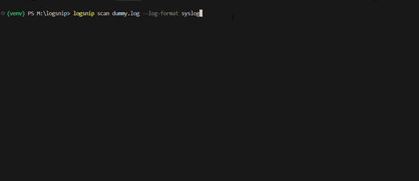

# LogSnip


**AI-powered Linux log analyzer and diagnostic tool.**

LogSnip replaces manual log-grepping with instant, AI-driven root-cause analysis. It scans your system logs, identifies critical failures, and provides the exact remediation commands needed to fix them.



---

## Motivation

Manual log analysis during system failures is slow, error-prone, and requires deep domain knowledge. LogSnip was built to reduce Mean Time To Repair (MTTR) by automating the triage step — letting developers and sysadmins focus on fixing, not searching.

---

## 🚀 Features

- **Multi-Format Support** — Natively parses `syslog`, `nginx`, `apache`, and `journald` formats.
- **Severity Filtering** — Automatically isolates `CRITICAL` and `ERROR` events from background noise.
- **Actionable Diagnostics** — Powered by Llama 3.3 70B (via Groq), providing root-cause explanations and single-line fix commands.
- **Structured Reporting** — Export diagnostics to JSON for integration into CI/CD or team pipelines.
- **Fault-Tolerant CLI** — Gracefully handles missing files and clean logs without crashing.

---

## Prerequisites

- **Python 3.8+**
- A free **Groq API key** — get one at [console.groq.com](https://console.groq.com/)

---

## 📦 Installation

1. **Clone the repository**

   ```bash
   git clone https://github.com/mittalsukhansh/logsnip.git
   cd logsnip
   ```

2. **Create a virtual environment** *(recommended)*

   ```bash
   python -m venv .venv

   # Windows
   .venv\Scripts\activate

   # macOS / Linux
   source .venv/bin/activate
   ```

3. **Install dependencies**

   ```bash
   pip install -r requirements.txt
   ```

4. **Set up your API key**

   Create a `.env` file in the project root:

   ```
   GROQ_API_KEY=your_groq_api_key_here
   ```

   > **Note:** The `.env` file is git-ignored by default — your key stays local.

---

## Usage

### Scan a log file

```bash
python main.py scan <path_to_log_file>
```

**Example:**

```bash
python main.py scan /var/log/syslog
```

Scan with a specific log format:

```bash
python main.py scan /var/log/nginx/error.log --log-format nginx
```

Save the report as JSON:

```bash
python main.py scan /var/log/syslog --output report.json
```

### Check the version

```bash
python main.py version
```

```
logsnip v1.0.0
```

### Get help

```bash
python main.py --help
python main.py scan --help
```

---

## Example

Given a log file like this:

```
May 25 17:35:12 kernel: [ 0.000000] Linux version 5.15.0-generic
May 25 17:36:01 systemd[1]: Started System Logging Service.
May 25 17:38:45 NetworkManager[845]: <error> [1685000000.1234] wifi: AP connection failed
```

Running:

```bash
python main.py scan dummy.log
```

Produces output similar to:

```
Found 1 issues. Analyzing...

--- 🛠️  Diagnostic Report ---
Line 3:
  Issue: NetworkManager failed to associate with the wireless access point.
  Fix:   sudo systemctl restart NetworkManager
```

With `--output report.json`, the raw JSON is saved instead:

```json
{
    "results": [
        {
            "line": "3",
            "explanation": "NetworkManager failed to associate with the wireless access point.",
            "fix_command": "sudo systemctl restart NetworkManager"
        }
    ]
}
```

> The AI response will vary — it adapts to the actual log content.

---

## Project Structure

```
logsnip/
├── main.py            # CLI entry point (scan + version commands)
├── pyproject.toml     # Package config & entry point
├── requirements.txt   # Python dependencies
├── .env               # Groq API key (not tracked by git)
├── .gitignore         # Ignores .env, __pycache__, venv/, build/, *.log
├── assets/
│   └── demo.gif       # Demo recording
├── dummy.log          # Sample log file for testing
├── LICENSE            # MIT License
└── README.md
```

---

## How It Works

1. **Read** — Opens the target log file and reads all lines.
2. **Filter** — Applies a format-specific regex pattern to extract only high-severity lines, preserving original line numbers.
3. **Diagnose** — Sends filtered lines to the Groq API (Llama 3.3 70B), instructing the model to act as a Linux sys-admin and return structured JSON with root causes and fix commands.
4. **Output** — Prints formatted JSON to the terminal, or saves it to a file via `--output`.

---

## Built With

| Tool | Purpose |
|------|---------|
| [Typer](https://typer.tiangolo.com/) | CLI framework |
| [Groq](https://console.groq.com/) | Fast LLM inference API |
| [python-dotenv](https://pypi.org/project/python-dotenv/) | Environment variable management |
| [Llama 3.3 70B](https://huggingface.co/meta-llama) | Language model for log analysis |

---

## License

This project is licensed under the MIT License. See [LICENSE](LICENSE) for details.

